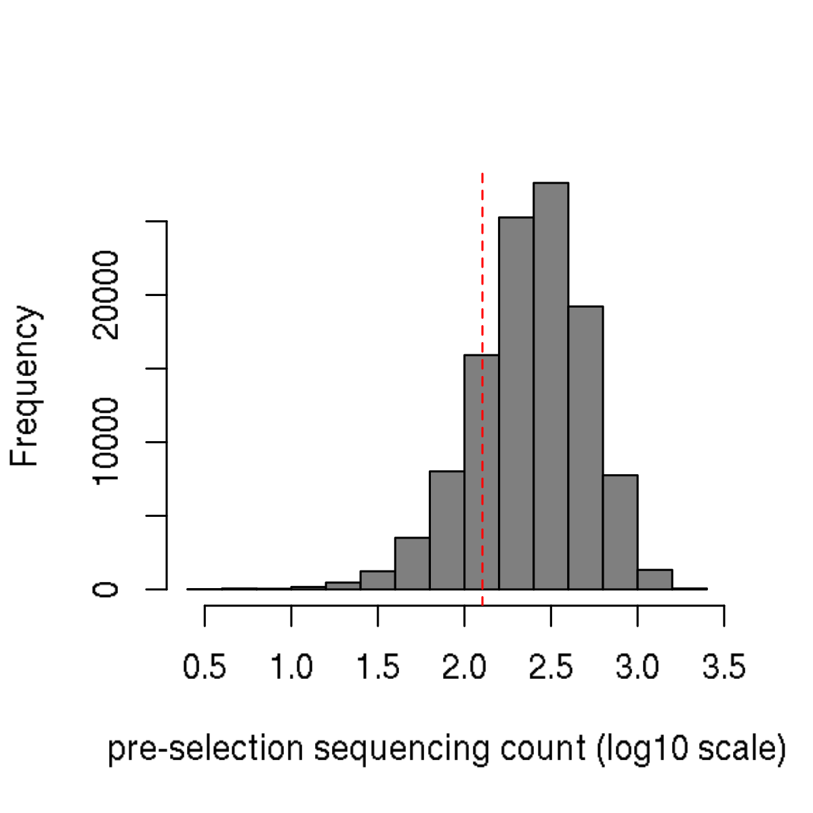
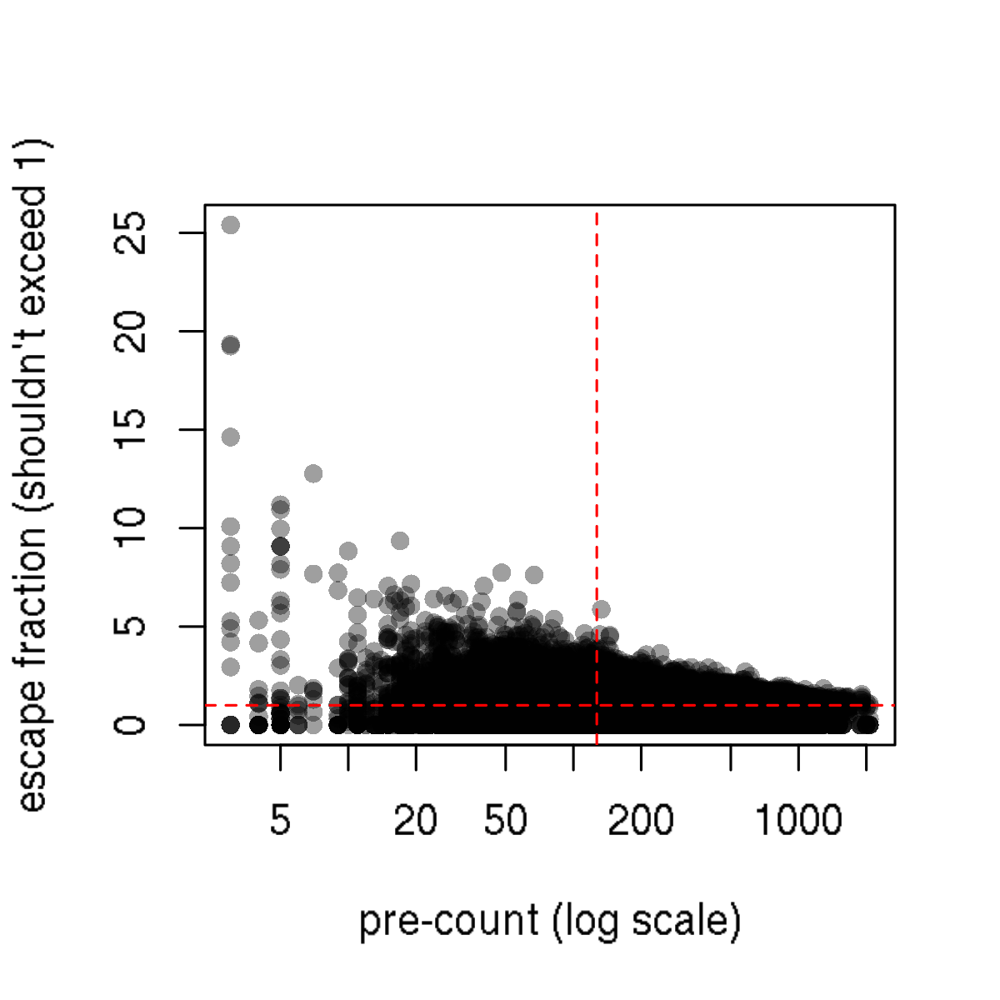
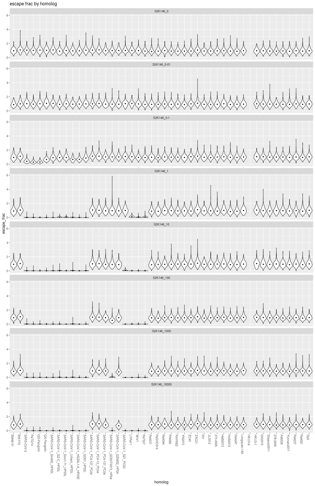
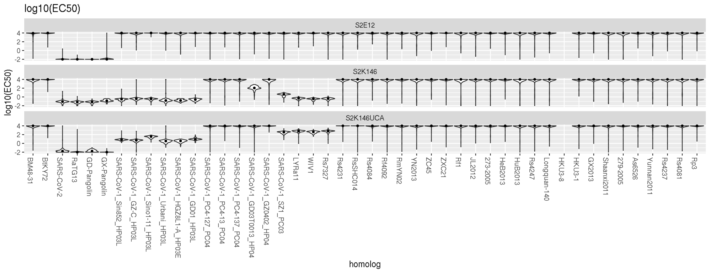
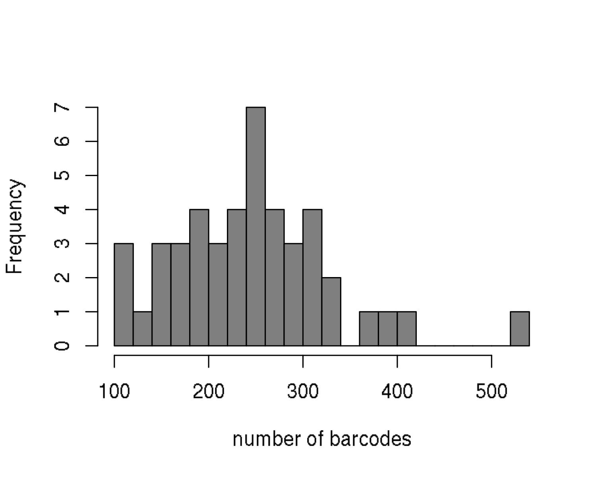
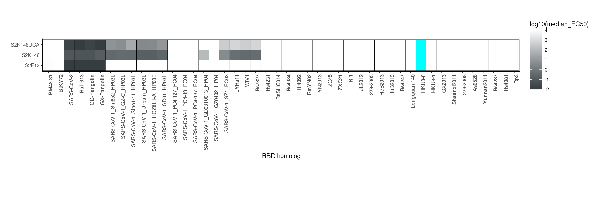

Compute per-homolog EC50
================
Tyler Starr
08/03/2021

-   [Data input](#data-input)
-   [Filtering](#filtering)
-   [Escape fraction per homolog](#escape-fraction-per-homolog)
-   [Heatmaps](#heatmaps)
-   [Output](#output)

For some antibodies, we have ‘binding curves’ where we measured
binding/escape across a concentration series of antibody. This script
complements homolog\_escape to compute an “EC50” of each homolog for the
antibody.

``` r
require("knitr")
knitr::opts_chunk$set(echo = T)
knitr::opts_chunk$set(dev.args = list(png = list(type = "cairo")))

#list of packages to install/load
packages = c("yaml","data.table","tidyverse","gridExtra")
#install any packages not already installed
installed_packages <- packages %in% rownames(installed.packages())
if(any(installed_packages == F)){
  install.packages(packages[!installed_packages])
}
#load packages
invisible(lapply(packages, library, character.only=T))

#read in config file
config <- read_yaml("config.yaml")

#make output directory
if(!file.exists(config$EC50_scores_dir)){
  dir.create(file.path(config$EC50_scores_dir))
}
```

Session info for reproducing environment:

``` r
sessionInfo()
```

    ## R version 3.6.2 (2019-12-12)
    ## Platform: x86_64-pc-linux-gnu (64-bit)
    ## Running under: Ubuntu 18.04.4 LTS
    ## 
    ## Matrix products: default
    ## BLAS/LAPACK: /app/software/OpenBLAS/0.3.7-GCC-8.3.0/lib/libopenblas_haswellp-r0.3.7.so
    ## 
    ## locale:
    ##  [1] LC_CTYPE=en_US.UTF-8       LC_NUMERIC=C              
    ##  [3] LC_TIME=en_US.UTF-8        LC_COLLATE=en_US.UTF-8    
    ##  [5] LC_MONETARY=en_US.UTF-8    LC_MESSAGES=en_US.UTF-8   
    ##  [7] LC_PAPER=en_US.UTF-8       LC_NAME=C                 
    ##  [9] LC_ADDRESS=C               LC_TELEPHONE=C            
    ## [11] LC_MEASUREMENT=en_US.UTF-8 LC_IDENTIFICATION=C       
    ## 
    ## attached base packages:
    ## [1] stats     graphics  grDevices utils     datasets  methods   base     
    ## 
    ## other attached packages:
    ##  [1] gridExtra_2.3     forcats_0.4.0     stringr_1.4.0     dplyr_0.8.3      
    ##  [5] purrr_0.3.3       readr_1.3.1       tidyr_1.0.0       tibble_3.0.2     
    ##  [9] ggplot2_3.3.0     tidyverse_1.3.0   data.table_1.12.8 yaml_2.2.0       
    ## [13] knitr_1.26       
    ## 
    ## loaded via a namespace (and not attached):
    ##  [1] Rcpp_1.0.3       cellranger_1.1.0 pillar_1.4.5     compiler_3.6.2  
    ##  [5] dbplyr_1.4.2     tools_3.6.2      digest_0.6.23    lubridate_1.7.4 
    ##  [9] jsonlite_1.6     evaluate_0.14    lifecycle_0.2.0  gtable_0.3.0    
    ## [13] pkgconfig_2.0.3  rlang_0.4.7      reprex_0.3.0     cli_2.0.0       
    ## [17] rstudioapi_0.10  DBI_1.1.0        haven_2.2.0      xfun_0.11       
    ## [21] withr_2.1.2      xml2_1.2.2       httr_1.4.1       fs_1.3.1        
    ## [25] hms_0.5.2        generics_0.0.2   vctrs_0.3.1      grid_3.6.2      
    ## [29] tidyselect_1.1.0 glue_1.3.1       R6_2.4.1         fansi_0.4.0     
    ## [33] readxl_1.3.1     rmarkdown_2.0    modelr_0.1.5     magrittr_1.5    
    ## [37] backports_1.1.5  scales_1.1.0     ellipsis_0.3.0   htmltools_0.4.0 
    ## [41] rvest_0.3.5      assertthat_0.2.1 colorspace_1.4-1 stringi_1.4.3   
    ## [45] munsell_0.5.0    broom_0.7.0      crayon_1.3.4

## Data input

Read in table of escape scores for barcodes, also annotated with variant
counts and expression that we’ll use in filtering. Remove barcodes with
pre\_count of 0 or NA expression effects – these are likely barcodes
that either do not express well, are generally low-frequency, or were
actually “mutant” variants (but no mutation in the SSM) which were not
part of the sub-pool of the homologs experiments that we used for these
antibody selections. Last, subset on the set of antibodies that are
actually in the “EC50” style experiment rather than single-concentration
escape, and the “extant” sarb RBDs in th elibrary.

``` r
dt <- data.table(read.csv(file=config$escape_fracs_barcodes,stringsAsFactors = F))
dt <- dt[pre_count>0 & !is.na(expression),]
dt <- dt[antibody %in% c(config$S2K146_EC50,config$S2K146UCA_EC50,config$S2E12_EC50) & target %in% config$targets_ordered,]
```

## Filtering

We will use the per-barcode pre\_count and expression scores to filter
out escape scores used in computing per-homolog escape.

First, let’s look at the distribution of pre-counts across barcodes. The
median pre-count is 358. Vertical lines on the two plots below indicate
a threshold for pre\_count of 1/2 that of the median pre-count, which is
what we’ll apply below. This is a stringent cutoff, but we have such a
high degree of over-barcoding that we can do this.

``` r
hist(log10(dt$pre_count),col="gray50",main="",xlab="pre-selection sequencing count (log10 scale)");abline(v=log10(0.5*median(dt$pre_count)),col="red",lty=2)
```


Let’s also see how escape fraction correlates with pre-count.
Theoretically, escape\_fraction should not exceed 1, though we see it
does, particularly when pre\_count is lower.

``` r
plot(dt$pre_count,dt$escape_frac,pch=16,col="#00000060",log="x",xlab="pre-count (log scale)",ylab="escape fraction (shouldn't exceed 1)")
abline(h=1,lty=2,col="red")
abline(v=0.5*median(dt$pre_count),lty=2,col="red")
```



Remove barcode measurements for those where pre-count is less than half
the median pre-count. This corresponds to removing variants with less
than 179 pre-sort counts.

``` r
dt <- dt[pre_count > 0.5*median(dt$pre_count),]
```

Censor NA measurements for AncSARS1a\_alt and HKU3-8 which were
generally non-expressing from our prior measurements (and so any
barcodes that eke through are probably poorly expressed/artefactual)

``` r
dt[target%in%c("AncSARS1a_alt","HKU3-8"),escape_frac:=NA]
dt[target%in%c("AncSARS1a_alt","HKU3-8"),expression:=NA]
```

## Escape fraction per homolog

Next, let’s visualize the escape fraction scores per barcode grouped by
variant, with violin plots.

``` r
#set factor order for homologs to display
dt$target <- factor(dt$target, levels=config$targets_ordered)

ggplot(dt,aes(x=target,y=escape_frac))+
  geom_violin(scale="width")+stat_summary(fun=median,geom="point",size=1)+
  ggtitle("escape frac by homolog")+xlab("homolog")+theme(axis.text.x=element_text(angle=-90,hjust=0))+
  facet_wrap(~antibody,ncol=1)
```

    ## Warning: Removed 40 rows containing non-finite values (stat_ydensity).

    ## Warning: Removed 40 rows containing non-finite values (stat_summary).



Can see some escape fracs above the theoretical maximum 1 escape frac.
Fix these to max = 1.

``` r
dt[escape_frac>1,escape_frac:=1]
```

Fit per-barcode EC50s

``` r
#separate antibody out into antibody column and concentration column
dt[,c("mAb"):=strsplit(antibody,split="_")[[1]][1],by="antibody"]
dt[,c("concentration"):=strsplit(antibody,split="_")[[1]][2],by="antibody"]
#stupid funciton ot convert concentration string to numeric
numeric_conc <- function(val){
  if(!is.na(as.numeric(val))){
    return(as.numeric(val))
  }else{
    return(as.numeric(sub("-",".",val)))
  }
}
dt[,conc:=numeric_conc(concentration),by="concentration"]
```

    ## Warning in numeric_conc(concentration): NAs introduced by coercion

    ## Warning in numeric_conc(concentration): NAs introduced by coercion

``` r
#define bind_frac as 1-escape_frac
dt[,bind_frac := 1-escape_frac]

#function to fit EC50 to bind_frac versus concentration
fit_EC50 <- function(bind_vec,conc_vec){
  fit <- nls(bind_vec ~ (a/(1+(EC50/conc_vec)^n))+b,
             start=list(a=1,b=0,EC50=10,n=2),
             lower=list(a=0.75,b=0,EC50=0.01,n=1/3),
             upper=list(a=1,b=0.25,EC50=10000,n=3),
             algorithm="port")
  return(summary(fit)$coefficients[c("EC50","a","b","n"),"Estimate"])
}

dt[,c("EC50") := tryCatch(fit_EC50(bind_frac,conc)[1],error=function(e){list(as.numeric(NA))}),by=c("library","barcode","mAb")]

#collapse to one row per barcode
dt <- unique(dt[,.(library,target,barcode,expression,mAb,EC50)])
```

Visualize distribution of EC50 fits for each homolog as violin plots

``` r
#set factor order for homologs to display
ggplot(dt,aes(x=target,y=log10(EC50)))+
  geom_violin(scale="width")+stat_summary(fun=median,geom="point",size=1)+
  ggtitle("log10(EC50)")+xlab("homolog")+theme(axis.text.x=element_text(angle=-90,hjust=0))+
  facet_wrap(~mAb,ncol=1)
```

    ## Warning: Removed 546 rows containing non-finite values (stat_ydensity).

    ## Warning: Removed 546 rows containing non-finite values (stat_summary).



Collapse each homolog escape fraction to its median EC50 across
barcodes.

``` r
dt[,median_EC50:=median(EC50,na.rm=T),by=c("library","target","mAb")] #median EC50 across all barcodes for a homolog
dt[,n_barcodes:=sum(!is.na(EC50)),by=c("library","target","mAb")] #the number of barcodes on which a homolog median EC50 was calculated
dt[,median_expression:=median(expression,na.rm=T),by=c("library","target")] #the average expression of that homolog
dt_collapse <- unique(dt[,.(library,target,median_expression,mAb,median_EC50,n_barcodes)]) #collapse down to homolog-level data instead of barcode-level
dt_collapse[is.na(median_EC50),n_barcodes:=NA]
```

Make histograms showing the typical number of barcodes on which a
homolog escape fraction was averaged across. The median number of
barcodes across all homolog escape fracs is 265.

``` r
hist(dt_collapse$n_barcodes,main="",col="gray50",xlab="number of barcodes",breaks=20)
```



## Heatmaps

Last, make heatmaps illustrating the EC50 of each homolog versus each
antibody. These will be what we’ll eventually align to the phylogeny as
our data display?

``` r
dt_collapse$target <- factor(dt_collapse$target,levels=c(config$EurAf_extant,config$SARS2_extant,config$SARS1_extant,config$Clade2_extant))

ggplot(dt_collapse,aes(target,mAb))+geom_tile(aes(fill=log10(median_EC50)),color="black",lwd=0.1)+
  scale_fill_gradient(high="white",low="#353D41",limits=c(-2,4),na.value="cyan")+
  labs(x="RBD homolog",y="")+theme_classic(base_size=9)+
  coord_equal()+theme(axis.text.x=element_text(angle=90,hjust=1,face="bold"))
```



``` r
invisible(dev.print(pdf, paste(config$EC50_scores_dir,"/heatmap_homologs.pdf",sep="")))
```

## Output

Save our final per-homolog and per-bc EC50s

``` r
dt_collapse %>%
  mutate_if(is.numeric, round, digits=5) %>%
  write.csv(file=config$EC50_homologs, row.names=F)

dt[,.(library,target,barcode,expression,mAb,EC50)] %>%
  mutate_if(is.numeric, round, digits=5) %>%
  write.csv(file=config$EC50_barcodes, row.names=F)
```
