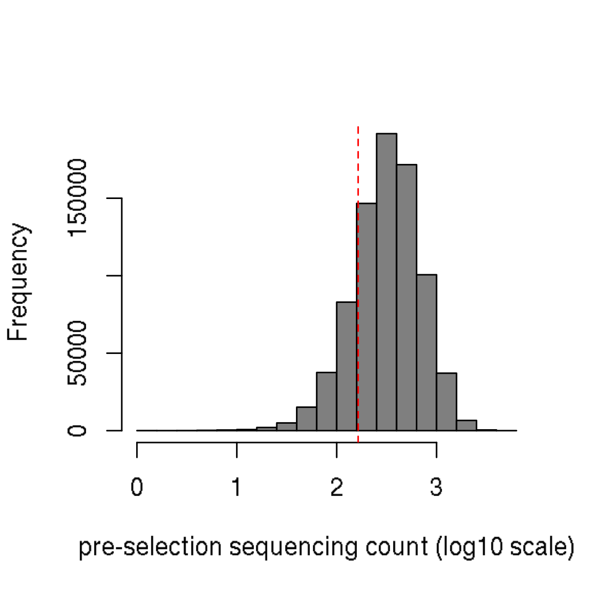
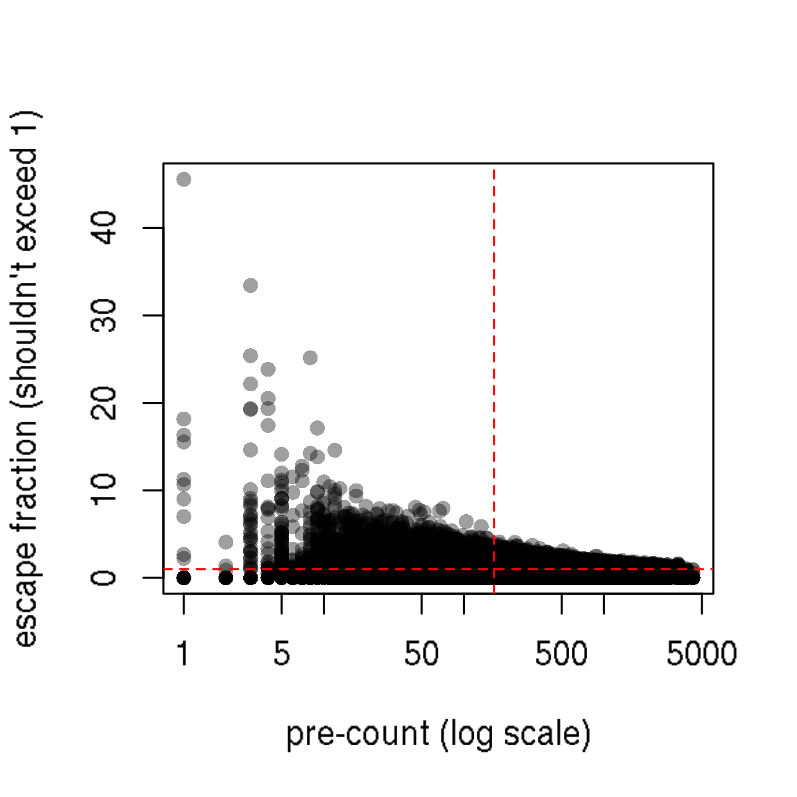
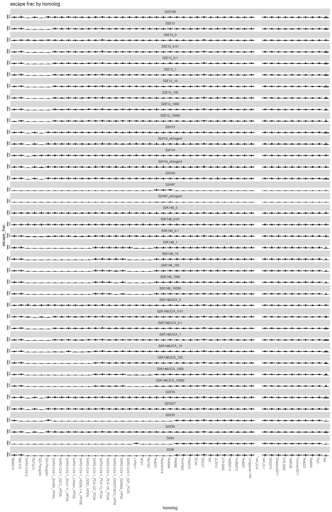
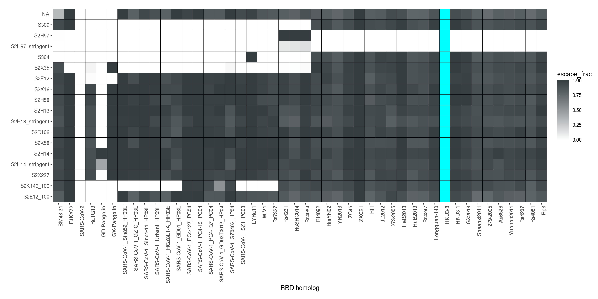

Compute per-homolog escape
================
Tyler Starr
11/20/2020

-   [Data input](#data-input)
-   [Filtering](#filtering)
-   [Escape fraction per homolog](#escape-fraction-per-homolog)
-   [Heatmaps](#heatmaps)
-   [Output](#output)

This notebook filters the per-barcode escape fraction estimates, and
computes summary escape fractions for each homolog.

``` r
require("knitr")
knitr::opts_chunk$set(echo = T)
knitr::opts_chunk$set(dev.args = list(png = list(type = "cairo")))

#list of packages to install/load
packages = c("yaml","data.table","tidyverse","gridExtra")
#install any packages not already installed
installed_packages <- packages %in% rownames(installed.packages())
if(any(installed_packages == F)){
  install.packages(packages[!installed_packages])
}
#load packages
invisible(lapply(packages, library, character.only=T))

#read in config file
config <- read_yaml("config.yaml")

#make output directory
if(!file.exists(config$escape_scores_dir)){
  dir.create(file.path(config$escape_scores_dir))
}
```

Session info for reproducing environment:

``` r
sessionInfo()
```

    ## R version 3.6.2 (2019-12-12)
    ## Platform: x86_64-pc-linux-gnu (64-bit)
    ## Running under: Ubuntu 18.04.4 LTS
    ## 
    ## Matrix products: default
    ## BLAS/LAPACK: /app/software/OpenBLAS/0.3.7-GCC-8.3.0/lib/libopenblas_haswellp-r0.3.7.so
    ## 
    ## locale:
    ##  [1] LC_CTYPE=en_US.UTF-8       LC_NUMERIC=C              
    ##  [3] LC_TIME=en_US.UTF-8        LC_COLLATE=en_US.UTF-8    
    ##  [5] LC_MONETARY=en_US.UTF-8    LC_MESSAGES=en_US.UTF-8   
    ##  [7] LC_PAPER=en_US.UTF-8       LC_NAME=C                 
    ##  [9] LC_ADDRESS=C               LC_TELEPHONE=C            
    ## [11] LC_MEASUREMENT=en_US.UTF-8 LC_IDENTIFICATION=C       
    ## 
    ## attached base packages:
    ## [1] stats     graphics  grDevices utils     datasets  methods   base     
    ## 
    ## other attached packages:
    ##  [1] gridExtra_2.3     forcats_0.4.0     stringr_1.4.0     dplyr_0.8.3      
    ##  [5] purrr_0.3.3       readr_1.3.1       tidyr_1.0.0       tibble_3.0.2     
    ##  [9] ggplot2_3.3.0     tidyverse_1.3.0   data.table_1.12.8 yaml_2.2.0       
    ## [13] knitr_1.26       
    ## 
    ## loaded via a namespace (and not attached):
    ##  [1] Rcpp_1.0.3       cellranger_1.1.0 pillar_1.4.5     compiler_3.6.2  
    ##  [5] dbplyr_1.4.2     tools_3.6.2      digest_0.6.23    lubridate_1.7.4 
    ##  [9] jsonlite_1.6     evaluate_0.14    lifecycle_0.2.0  gtable_0.3.0    
    ## [13] pkgconfig_2.0.3  rlang_0.4.7      reprex_0.3.0     cli_2.0.0       
    ## [17] rstudioapi_0.10  DBI_1.1.0        haven_2.2.0      xfun_0.11       
    ## [21] withr_2.1.2      xml2_1.2.2       httr_1.4.1       fs_1.3.1        
    ## [25] hms_0.5.2        generics_0.0.2   vctrs_0.3.1      grid_3.6.2      
    ## [29] tidyselect_1.1.0 glue_1.3.1       R6_2.4.1         fansi_0.4.0     
    ## [33] readxl_1.3.1     rmarkdown_2.0    modelr_0.1.5     magrittr_1.5    
    ## [37] backports_1.1.5  scales_1.1.0     ellipsis_0.3.0   htmltools_0.4.0 
    ## [41] rvest_0.3.5      assertthat_0.2.1 colorspace_1.4-1 stringi_1.4.3   
    ## [45] munsell_0.5.0    broom_0.7.0      crayon_1.3.4

## Data input

Read in table of escape scores for barcodes, also annotated with variant
counts and expression that we’ll use in filtering. Remove barcodes with
pre\_count of 0 or NA expression effects – these are likely barcodes
that either do not express well, are generally low-frequency, or were
actually “mutant” variants (but no mutation in the SSM) which were not
part of the sub-pool of the homologs experiments that we used for these
antibody selections.

``` r
dt <- data.table(read.csv(file=config$escape_fracs_barcodes,stringsAsFactors = F))
dt <- dt[pre_count>0 & !is.na(expression),]
```

## Filtering

We will use the per-barcode pre\_count and expression scores to filter
out escape scores used in computing per-homolog escape. First, let’s
look at the distribution of pre-counts across barcodes. Vertical lines
indicate the 10th percentile of pre-count where we will filter.

``` r
hist(log10(dt$pre_count),col="gray50",main="",xlab="pre-selection sequencing count (log10 scale)");abline(v=log10(quantile(dt$pre_count,0.1)),col="red",lty=2)
```


Let’s also see how escape fraction correlates with pre-count.
Theoretically, escape\_fraction should not exceed 1, though we see it
does, particularly when pre\_count is lower.

``` r
plot(dt$pre_count,dt$escape_frac,pch=16,col="#00000060",log="x",xlab="pre-count (log scale)",ylab="escape fraction (shouldn't exceed 1)")
abline(h=1,lty=2,col="red")
abline(v=quantile(dt$pre_count,0.1),lty=2,col="red")
```



Remove barcode measurements for those with pre-counts in the lowest ten
percentile. This corresponds to removing variants with less than 72
pre-sort counts.

``` r
dt <- dt[pre_count > quantile(dt$pre_count,0.1),]
```

Censor NA measurements for AncSARS1a\_alt and HKU3-8 which were
generally non-expressing (and so any barcodes that eke through are
probably poorly expressed/artefactual)

``` r
dt[target%in%c("AncSARS1a_alt","HKU3-8"),escape_frac:=NA]
```

## Escape fraction per homolog

Next, let’s visualize the escape fraction scores per barcode grouped by
variant, with violin plots.

``` r
#set factor order for homologs to display
dt$target <- factor(dt$target, levels=config$targets_ordered)

ggplot(dt,aes(x=target,y=escape_frac))+
  geom_violin(scale="width")+stat_summary(fun=median,geom="point",size=1)+
  ggtitle("escape frac by homolog")+xlab("homolog")+theme(axis.text.x=element_text(angle=-90,hjust=0))+
  facet_wrap(~antibody,ncol=1)
```

    ## Warning: Removed 33 rows containing non-finite values (stat_ydensity).

    ## Warning: Removed 33 rows containing non-finite values (stat_summary).



Collapse each homolog escape fraction to its median across barcodes.

``` r
dt[,median_escape_frac:=median(escape_frac,na.rm=T),by=c("library","target","antibody")]
dt[,n_barcodes:=sum(!is.na(escape_frac)),by=c("library","target","antibody")]
dt[,median_expression:=median(expression,na.rm=T),by=c("library","target")]
dt_collapse <- unique(dt[,.(library,target,median_expression,antibody,median_escape_frac,n_barcodes)])
dt_collapse[,expression:=median_expression];dt_collapse[,escape_frac:=median_escape_frac]
dt_collapse <- dt_collapse[,.(library,target,expression,antibody,escape_frac,n_barcodes)]
dt_collapse[is.na(escape_frac),n_barcodes:=NA]
```

Histogram below shows that a few medians end up above the theoretical
max escape fraction of 1. We set these to the maximum 1.

``` r
hist(dt_collapse$escape_frac,main="",col="gray50",xlab="homolog escape fraction",breaks=20)
```


``` r
dt_collapse[escape_frac>1,escape_frac:=1]
```

Also make histograms showing the typical number of barcodes on which a
homolog escape fraction was averaged across. The median number of
barcodes across all homolog escape fracs is 286.

``` r
hist(dt_collapse$n_barcodes,main="",col="gray50",xlab="number of barcodes",breaks=20)
```


## Heatmaps

Last, make heatmaps illustrating the fraction escape of each homolog
versus each antibody. These will be what we’ll eventually align to the
phylogeny as our data display?

First, for all homologs in the library, including ancestors. This is the
default ordering of homologs set by the factor variable.

``` r
#set antibody order as factor from config
dt_collapse$antibody <- factor(dt_collapse$antibody,levels=config$antibodies_ordered)

ggplot(dt_collapse,aes(target,antibody))+geom_tile(aes(fill=escape_frac),color="black",lwd=0.1)+
  scale_fill_gradient(low="white",high="#353D41",limits=c(0,1),na.value="cyan")+
  labs(x="RBD homolog",y="")+theme_classic(base_size=9)+
  coord_equal()+theme(axis.text.x=element_text(angle=90,hjust=1,face="bold"))
```


``` r
invisible(dev.print(pdf, paste(config$escape_scores_dir,"/heatmap_homologs_all.pdf",sep="")))
```

Extant homologs.

``` r
extant <- c(config$EurAf_extant,config$SARS2_extant,config$SARS1_extant,config$Clade2_extant)

temp <- dt_collapse[target %in% extant,];temp$target <- factor(temp$target,levels=extant)

ggplot(temp,aes(target,antibody))+geom_tile(aes(fill=escape_frac),color="black",lwd=0.1)+
  scale_fill_gradient(low="white",high="#353D41",limits=c(0,1),na.value="cyan")+
  labs(x="RBD homolog",y="")+theme_classic(base_size=9)+
  coord_equal()+theme(axis.text.x=element_text(angle=90,hjust=1,face="bold"))
```



``` r
invisible(dev.print(pdf, paste(config$escape_scores_dir,"/heatmap_homologs_extant.pdf",sep="")))
```

MAP ancestors.

``` r
ancestors <- c(config$ancestors_MAP)

temp <- dt_collapse[target %in% ancestors,];temp$target <- factor(temp$target,levels=ancestors)

ggplot(temp,aes(target,antibody))+geom_tile(aes(fill=escape_frac),color="black",lwd=0.1)+
  scale_fill_gradient(low="white",high="#353D41",limits=c(0,1),na.value="cyan")+
  labs(x="RBD homolog",y="")+theme_classic(base_size=9)+
  coord_equal()+theme(axis.text.x=element_text(angle=90,hjust=1,face="bold"))
```


``` r
invisible(dev.print(pdf, paste(config$escape_scores_dir,"/heatmap_homologs_MAP-ancestors.pdf",sep="")))
```

MAP plus alternative ancestors.

``` r
ancestors <- c(config$ancestors_MAP_v_alt)

temp <- dt_collapse[target %in% ancestors,];temp$target <- factor(temp$target,levels=ancestors)

ggplot(temp,aes(target,antibody))+geom_tile(aes(fill=escape_frac),color="black",lwd=0.1)+
  scale_fill_gradient(low="white",high="#353D41",limits=c(0,1),na.value="cyan")+
  labs(x="RBD homolog",y="")+theme_classic(base_size=9)+
  coord_equal()+theme(axis.text.x=element_text(angle=90,hjust=1,face="bold"))
```


``` r
invisible(dev.print(pdf, paste(config$escape_scores_dir,"/heatmap_homologs_all-ancestors.pdf",sep="")))
```

## Output

Save our final per-homolog escape fraction estimates for each antibody.

``` r
dt_collapse %>%
  mutate_if(is.numeric, round, digits=5) %>%
  write.csv(file=config$escape_fracs_homologs, row.names=F)
```
