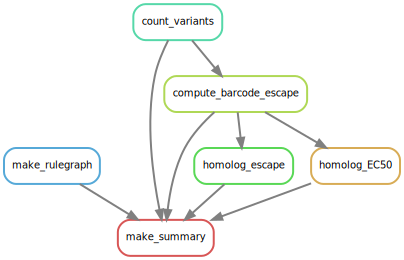

# Summary

Analysis run by [Snakefile](../../Snakefile)
using [this config file](../../config.yaml).
See the [README in the top directory](../../README.md)
for details.

Here is the rule graph of the computational workflow:

Here is the Markdown output of each notebook in the workflow:

1. [Count variants by barcode](count_variants.md).
   Creates a [variant counts file](../counts/variant_counts.csv)
   giving counts of each barcoded variant in each sample.

2. [Compute escape fractions](compute_barcode_escape.md) for individual barcodes.

3. [Determine homolog escape fraction](homolog_escape.md) averaged across all barcodes. Generates summary plots including heatmaps.